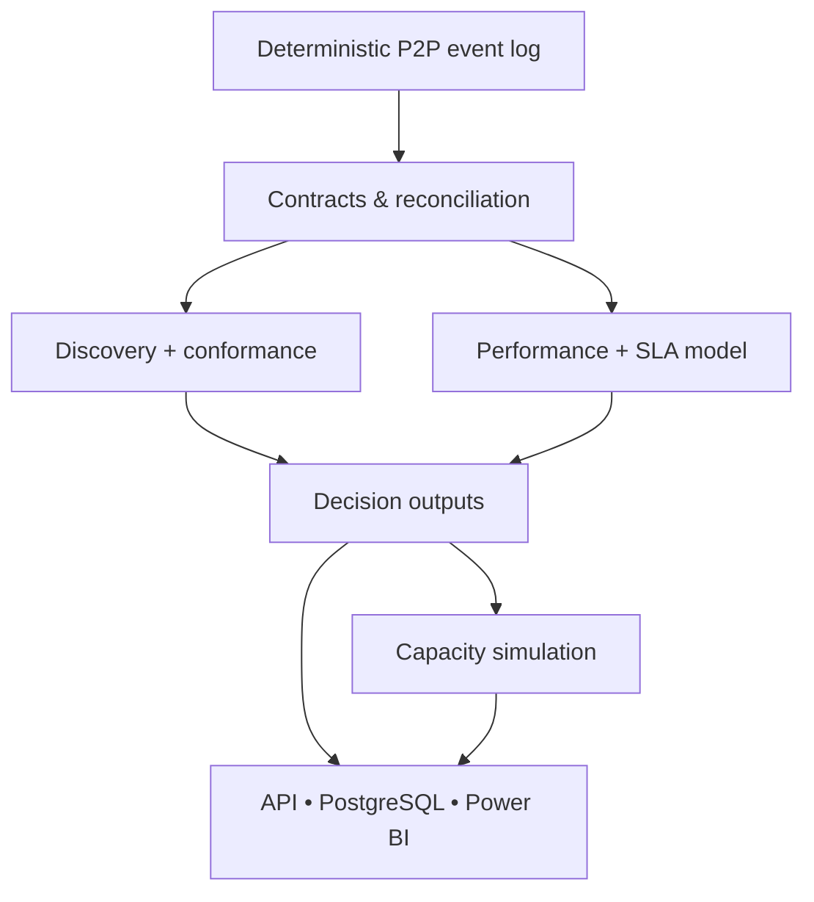

# Enterprise Process Mining & Intelligent Workflow Optimization

[](https://github.com/muratmiracg-dev/Enterprise-Process-Mining-Intelligent-Workflow-Optimization/actions/workflows/ci.yml)
[](https://github.com/muratmiracg-dev/Enterprise-Process-Mining-Intelligent-Workflow-Optimization/actions/workflows/codeql.yml)
[](pyproject.toml)
[](tests)
[](docs/validation.md)
[](data/demo)
[](LICENSE)

An end-to-end, portfolio-grade Purchase-to-Pay process intelligence platform
that discovers how work actually flows, measures conformance against a governed
BPMN target, predicts SLA risk early, and quantifies capacity interventions
before implementation.

**Türkçe dokümantasyon:** [README_TR.md](README_TR.md)


## Executive result

The reproducible synthetic benchmark contains **12,000 cases, 166,551 events,
22 activities, 150 resources, and 14 process variants**. The analysis found that
only **62.08%** of cases meet SLA, **21.98%** contain rework, and **98.40%** of
cycle time is estimated waiting rather than touch time.

| Decision metric | Evidence |
|---|---:|
| Median cycle time | 205.57 hours |
| P90 cycle time | 307.54 hours |
| SLA adherence | 62.08% |
| Straight-through rate | 42.32% |
| Mean conformance fitness | 91.62% |
| SLA model ROC AUC | 0.822 |
| Recommended scenario | Combined Optimization |
| Simulated cycle-time reduction | 19.42% |
| Simulated SLA uplift | +13.63 pp |
| Estimated annual value | $2.21M |
| First-year ROI | 8.84x |

The business recommendation is to combine rules-based low-risk approval,
targeted Accounts Payable capacity, and supplier lead-time intervention. The
result is a **decision hypothesis from simulation**, not a guaranteed forecast;
production use requires calibrated cost assumptions and a controlled pilot.

## What makes this a Business Analyst project

- Translates a Purchase-to-Pay operating problem into an event-data contract,
  BPMN target process, KPI catalog, and acceptance criteria.
- Uses PM4Py-backed discovery plus transparent, testable Python analytics.
- Connects process variants, nonconformance, bottlenecks, rework, and resource
  workload to operational causes.
- Scores SLA risk at Purchase Order creation using only information available at
  that decision point.
- Tests interventions through replicated queue-network simulation with explicit
  investment and value assumptions.
- Delivers stakeholder-ready Power BI, Excel, API, PostgreSQL, observability,
  bilingual report, and executive presentation assets.

## Solution architecture




## Repository map

| Path | Purpose |
|---|---|
| `src/process_optimizer/` | Discovery, conformance, performance, prediction, simulation, API |
| `data/demo/` | Deterministic synthetic event log and case master |
| `reports/` | Machine-readable analysis and decision tables |
| `bpmn/` | BPMN 2.0.2 target-state model |
| `powerbi/` | PBIP starter, TMDL semantic model, DAX, theme, page spec |
| `sql/` | PostgreSQL operational schema, views, analytical queries |
| `observability/` | Prometheus rules and provisioned Grafana dashboard |
| `tests/` | Unit and integration test suite |
| `docs/` | Architecture, methodology, governance, runbooks, portfolio copy |
| `output/` | Bilingual report, presentation, and decision workbook |

## Quick start

### Local Python

```bash
python -m venv .venv
source .venv/bin/activate
python -m pip install -e ".[dev]"
python scripts/generate_demo_data.py
process-optimizer analyze
uvicorn process_optimizer.api:app --host 0.0.0.0 --port 8000
```

Open `http://localhost:8000/docs` for the OpenAPI UI.

### Docker Compose

```bash
cp .env.example .env
docker compose up --build
```

Services:

- API and OpenAPI: `http://localhost:8000/docs`
- Prometheus: `http://localhost:9090`
- Grafana: `http://localhost:3000`
- PostgreSQL: internal Compose network by default

Change all local-development passwords before any shared deployment.

## Analytical workflow

```bash
make generate       # regenerate 12,000 cases with seed 20260728
make analyze        # write report JSON and analytical tables
make test           # run the automated test suite
make coverage       # run tests and enforce >=90% coverage
make quality        # Ruff formatting and lint checks
make verify         # repository-level acceptance checks
```

The event and case files are compressed with a fixed gzip timestamp, making
regeneration byte-for-byte reproducible. CI compares regenerated files with the
committed benchmark.

## API

The FastAPI surface is intentionally read-only:

| Route | Purpose |
|---|---|
| `/healthz`, `/readyz` | Liveness and analysis readiness |
| `/metrics` | Prometheus exposition |
| `/api/v1/summary` | Executive KPIs and recommendation |
| `/api/v1/process-map` | Variants, DFG, activities, PM4Py reference |
| `/api/v1/conformance` | Target-process deviations |
| `/api/v1/bottlenecks` | Wait, rework, and resource evidence |
| `/api/v1/sla-risk` | Model metrics, risk bands, explainability |
| `/api/v1/simulations` | Scenario assumptions and outcomes |
| `/api/v1/governance` | Human-control policy and limitations |

## Decision artifacts

- [Bilingual executive report](output/pdf/Enterprise_Process_Mining_Executive_Report_EN_TR.pdf)
- [Executive presentation](output/presentation/Enterprise_Process_Mining_Executive_Deck_EN_TR.pptx)
- [Decision workbook](output/Process_Mining_Decision_Workbook.xlsx)
- [Power BI build kit](powerbi/README.md)
- [Portfolio and LinkedIn copy](docs/portfolio/README.md)

## Governance and limitations

All organizations, people, vendors, transactions, events, predictions, and
financial estimates are synthetic. The SLA model is validated on a temporal
holdout but is not production-calibrated. Risk scores prioritize analyst review;
they do not approve requests, reject invoices, authorize payments, or bypass
segregation-of-duties controls. See [model card](docs/sla-model-card.md),
[simulation methodology](docs/simulation-methodology.md), and
[threat model](docs/security-threat-model.md).

## Validation

The local acceptance run on Python 3.12 completed:

- **58 tests passed**
- **96.97% statement/branch-aware coverage**
- **0 duplicate event keys**
- **0 null required fields**
- BPMN, JSON, PBIP, CSV, PDF, PPTX, and XLSX structure checks
- visual render review for every report page, slide, and workbook sheet

See [validation evidence](docs/validation.md) and
[reproducibility notes](docs/methodology.md).

## Sources

The implementation uses primary documentation for PM4Py, BPMN, Power BI
Projects, FastAPI, PostgreSQL, Docker, GitHub Actions, and scikit-learn. Exact
links, versions, and access dates are recorded in [docs/sources.md](docs/sources.md).

## Author

**Murat Miraç Gedik** — Business/Data Analyst portfolio project focused on
process discovery, operational analytics, explainable SLA risk, and workflow
optimization.

## License

MIT — see [LICENSE](LICENSE).
