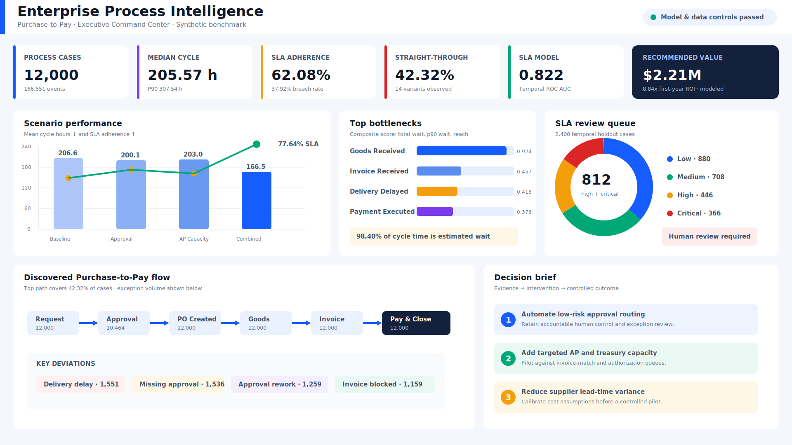
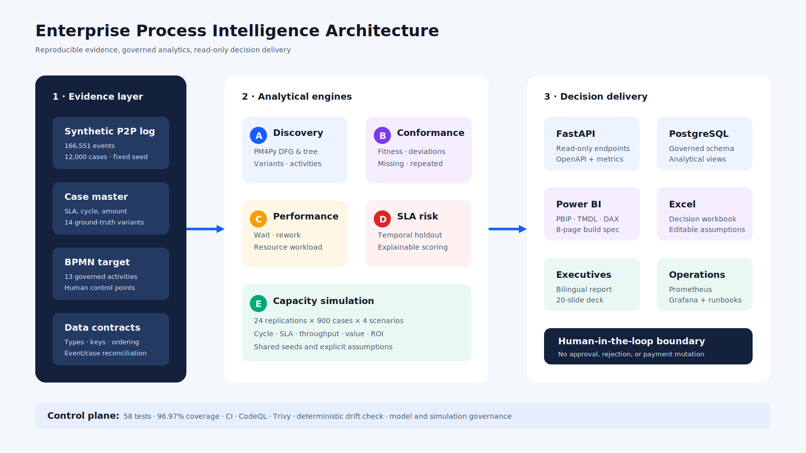

# Kurumsal Süreç Madenciliği ve Akıllı İş Akışı Optimizasyonu

Bu proje, Purchase-to-Pay sürecinin gerçekte nasıl ilerlediğini keşfeden, BPMN
hedef sürece uyumu ölçen, SLA ihlal riskini erken aşamada tahmin eden ve kapasite
kararlarını uygulama öncesinde simüle eden uçtan uca bir süreç zekâsı
platformudur.



## Yönetici özeti

Tekrarlanabilir sentetik veri seti **12.000 vaka, 166.551 olay, 22 aktivite,
150 kaynak ve 14 süreç varyantı** içerir. Analiz, vakaların yalnızca
**%62,08'inin SLA'i karşıladığını**, **%21,98'inde yeniden işleme bulunduğunu**
ve toplam çevrim süresinin tahmini **%98,40'ının bekleme süresi** olduğunu
göstermektedir.

| Karar metriği | Sonuç |
|---|---:|
| Medyan çevrim süresi | 205,57 saat |
| P90 çevrim süresi | 307,54 saat |
| SLA uyumu | %62,08 |
| Doğrudan tamamlama oranı | %42,32 |
| Ortalama conformance fitness | %91,62 |
| SLA modeli ROC AUC | 0,822 |
| Önerilen senaryo | Birleşik Optimizasyon |
| Simüle edilen çevrim süresi azalması | %19,42 |
| Simüle edilen SLA artışı | +13,63 yüzde puan |
| Tahmini yıllık değer | 2,21 milyon USD |
| İlk yıl yatırım getirisi | 8,84x |

Öneri; düşük riskli onayların kurallı otomasyonu, hedefli Accounts Payable
kapasite artışı ve tedarikçi teslim süresi iyileştirmesinin birlikte
uygulanmasıdır. Bu sonuç bir **simülasyon hipotezidir**; üretim kararı öncesinde
gerçek maliyetlerle kalibrasyon ve kontrollü pilot gerekir.

## Projenin iş analizi boyutu

- İş problemini olay verisi sözleşmesine, BPMN hedef sürece, KPI kataloğuna ve
  kabul kriterlerine dönüştürür.
- PM4Py destekli süreç keşfini şeffaf ve test edilebilir Python analitiğiyle
  birleştirir.
- Varyant, uyumsuzluk, darboğaz, yeniden işleme ve kaynak yükünü operasyonel
  nedenlerle ilişkilendirir.
- Yalnızca Purchase Order oluşturma anında bilinen verilerle SLA riskini
  tahmin eder.
- Müdahaleleri açık varsayımlı, tekrarlı kuyruk ağı simülasyonu ile sınar.
- Power BI, Excel, FastAPI, PostgreSQL, Docker, gözlemlenebilirlik, iki dilli
  rapor ve yönetici sunumu çıktıları sunar.

## Mimari



## Hızlı başlangıç

```bash
python -m venv .venv
source .venv/bin/activate
python -m pip install -e ".[dev]"
python scripts/generate_demo_data.py
process-optimizer analyze
uvicorn process_optimizer.api:app --port 8000
```

OpenAPI arayüzü: `http://localhost:8000/docs`

Docker ile:

```bash
cp .env.example .env
docker compose up --build
```

## Teslimatlar

- [Türkçe/İngilizce yönetici raporu](output/pdf/Enterprise_Process_Mining_Executive_Report_EN_TR.pdf)
- [Yönetici sunumu](output/presentation/Enterprise_Process_Mining_Executive_Deck_EN_TR.pptx)
- [Karar destek çalışma kitabı](output/Process_Mining_Decision_Workbook.xlsx)
- [Power BI geliştirme paketi](powerbi/README.md)
- [BPMN referans modeli](bpmn/purchase-to-pay-reference.bpmn)
- [Portföy, CV ve LinkedIn metinleri](docs/portfolio/README.md)

## Veri ve model yönetişimi

Tüm şirketler, kişiler, tedarikçiler, işlemler, olaylar ve finansal etkiler
sentetiktir. SLA modeli zamansal holdout ile değerlendirilmiştir ancak üretim
ortamına kalibre edilmemiştir. Risk skoru yalnızca analist incelemesini
önceliklendirir; fatura reddetmez, ödeme yetkilendirmez ve görevler ayrılığı
kontrollerini aşmaz.

## Doğrulama

Python 3.12 yerel kabul çalışmasında **58 test**, **%96,97 kapsam**, sıfır
yinelenen olay anahtarı ve sıfır zorunlu alan boşluğu doğrulandı. Ayrıntılar:
[docs/validation.md](docs/validation.md).

## Yazar

**Murat Miraç Gedik** — süreç keşfi, operasyonel analitik, açıklanabilir SLA
riski ve iş akışı optimizasyonu odaklı Business/Data Analyst portföy projesi.

## Lisans

MIT — [LICENSE](LICENSE).
