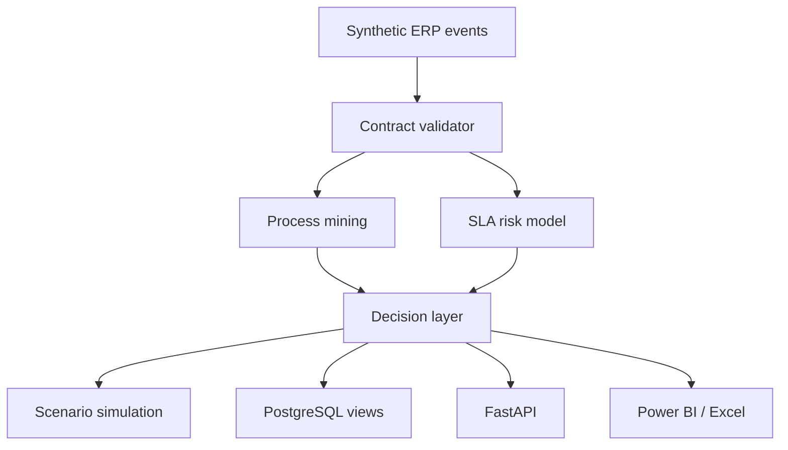

# Architecture

## Goal

Turn event-level Purchase-to-Pay evidence into governed management decisions
without giving the analytical system permission to mutate transactions.

## Components

| Component | Responsibility | Control |
|---|---|---|
| Generator | Produce deterministic P2P events and case outcomes | Fixed seed and gzip timestamp |
| Contracts | Normalize types, enforce keys, reconcile totals | Fail closed |
| Discovery | Variants, DFG, activity coverage | Deterministic sorting |
| Conformance | Compare case traces with ideal process | Explain missing/unexpected/repeated |
| Performance | Wait, rework, resource concentration | Case-level evidence retained |
| SLA model | Early breach-priority signal | Temporal holdout, human review |
| Simulation | Compare intervention hypotheses | Shared seeds, explicit assumptions |
| Delivery | JSON/CSV, API, SQL, PBIP, XLSX, report | Read-only analytical boundary |

## Data flow

1. Generator writes events and case master.
2. Repository adapter validates schema, types, uniqueness, ordering, and counts.
3. Analysis modules create decision tables.
4. PM4Py independently discovers a DFG and inductive process tree on a
   deterministic 2,000-case sample.
5. SLA prediction scores the latest 20% of cases chronologically.
6. Simulation runs 24 replications of 900 cases for each scenario.
7. Outputs are consumed by API, database views, dashboards, and documents.

## Trust boundaries

- Synthetic source boundary: no real corporate data.
- Analytical boundary: API has no create/update/delete routes.
- Decision boundary: risk scores are recommendations for review.
- Payment boundary: no payment service, key, or write permission exists.
- Deployment boundary: example credentials are local-only.

See [ADR-001](adr/001-csv-system-of-record.md),
[ADR-002](adr/002-temporal-holdout.md), and
[ADR-003](adr/003-human-in-the-loop.md).
